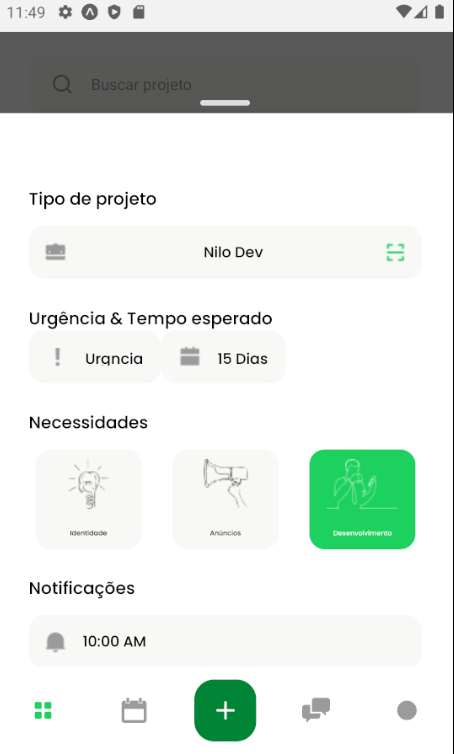

<h1 align="center">NewDemand</h1>

<!-- Getting Started -->
### INICIANDO O PROJETO

Para instalar o projeto em sua maquina siga os passos abaixo.

### INSTALAÇÃO
1. Clone o repositório

   ```sh
   git clone https://github.com/NiloMarcos/new-demand.git
   ```

2. Entre na pasta

   ```sh
   cd newdemand
   ```

3. Instale as dependências

   ```sh
   yarn
   ```

   ou

   ```sh
   npm i

### Iniciar a aplicação
1. Abra o terminal e rode a aplicação com
   ```sh
   yarn start
   ```

### Rode no dispositivo

### Apresentação da aplicação
<p align="center">

<tr>
  <td>
    
  </td>
  <td>
    
  </td>
  <td>
    
  </td>
</tr>
